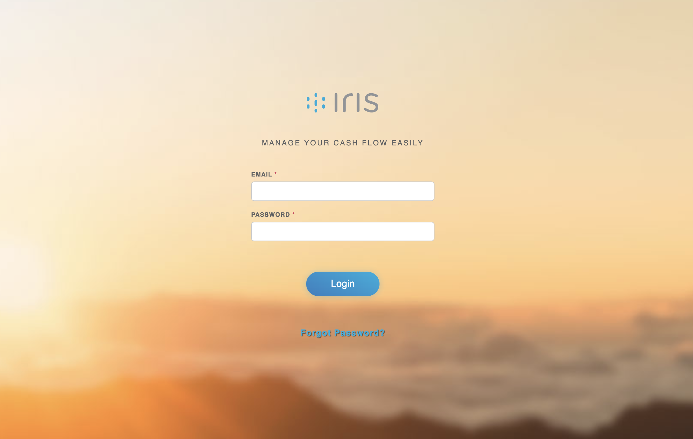
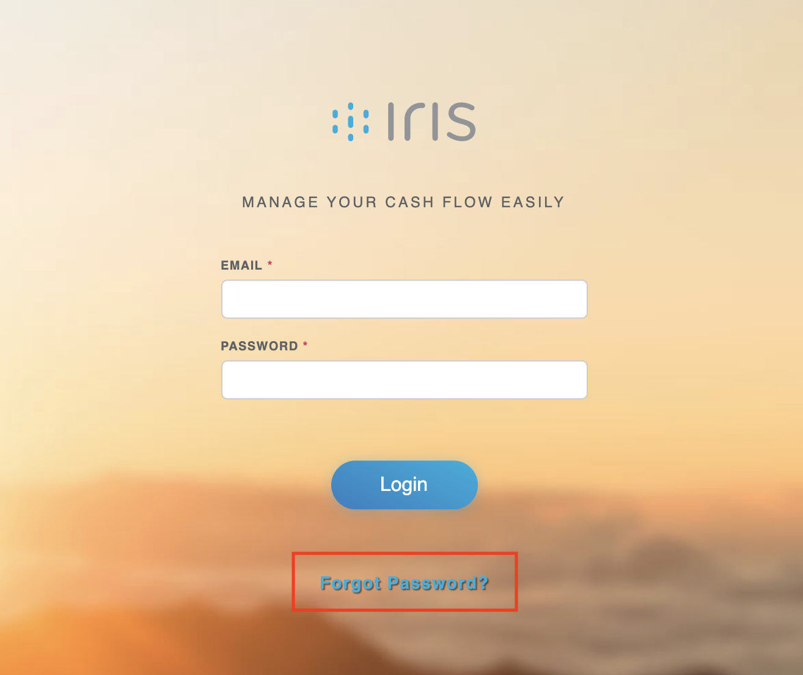
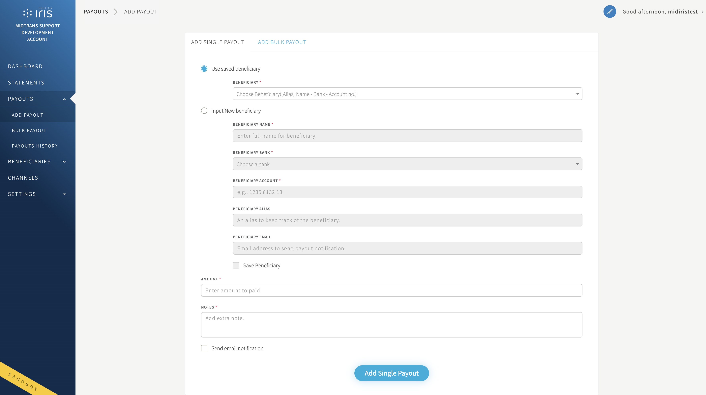

# Iris
Iris is Midtrans’ cash management solution. Iris connects to the banks’ hosts to enable seamless transfer using integrated APIs. With Iris API You can automate your payout process while rapidly scaling your business.

How it works? You can send Payouts in 3 simple steps
1. Add money in your Iris account through the Iris Dashboard or connect your bank account.
2. Add Receiver's Details.
3. Send payout instantly in just one click through the Dasboard.

## Business Flow
Iris comes in two business schemes Aggregator and Facilitator.
1. Aggregator
  Using an aggregator scheme, you will have Iris account as deposit account that can be top up from time to time using various channels. Any payouts will be done from the deposit account as a source of funds. Aggregator scheme is characterized by the following:

    * Source of funds comes from Midtrans’ bank accounts;
    * Partners can top up their deposit balance before disbursements; and
    * Faster onboarding process.
  
  
2. Facilitator
  Using an facilitator scheme, you can use your bank account as the source of funds for disbursements. In addition, to initiate transfers and payouts, you can inquire about your balance and check your statements using Iris’ API. The facilitator scheme is characterized by the following:
  
    * Source of funds comes from your bank accounts;
    * Disbursements can be done as long as the account balance is sufficient; and
    * The onboarding process involves registering partners’ bank accounts to the bank and Midtrans.
    
## Account
Before integrating with Iris, you need to get your Iris Account. Please get in touch with our business team. After completing the registration you will be given access to your [Iris Portal](https://app.sandbox.midtrans.com/iris). Once a you has been registered, it will have an access to our sandbox environment. Iris have two user role accounts Creator and Approver account


| Action                  | Creator | Approver |
| ------------------------| --------|----------|
| Create Payout           | Yes     | No       |
| Release Payout          | No      | Yes      |
| View/inquire Balance    | Yes     | Yes      |
| View/inquire Statements | Yes     | Yes      |

### How to add user?
// Todo elaborate. Need ask the SOP for this.


### Access Iris Portal
Please access Iris login page directly at http://app.midtrans.com/iris for production use or http://app.sandbox.midtrans.com/iris for sandbox environment. Enter the email and password the user used to create the Iris account, then click the "Login" button.


> Note: Midtrans do the following to maintain the security of your account.
> 
> * If there is no activity on Iris Portal for 15 minutes, the account will automatically logout.
> * Iris will do merchant to update the password every 90 days.
> * After three times of failed attempts Login to Iris, you will be temporarily locked out from trying to log in. When your account is locked, you will not be able to log in even with the correct password.
> * If the account is locked, you can't process anything from the Iris API. The API will respond `HTTP Basic: Access denied`

### Retrieving API Access Keys
API Access Keys will be used to access Iris' API. You can find them on the profile sidebar menu. Hover and click your username on the right top of the bar.


> API Keys and Merchant Key are unique for every Iris partner. Please always keep the Key confidential. Key Explanation:
> 
> * API Key: Used for authorization while calling Iris API from backend.
> 
> * Merchant Key: Used for validate whether the notification is originated from Midtrans or not.
> 

### How to unlock account (locked account)
Midtrans provides tolerance of up to 3x (three times) errors when the merchant tries to login into Iris Portal. If the tolerance limit is exceeded, the account will be locked automatically. This is to protect your account from illegitimate access.

To unlock the account, please inform the locked account to support@midtrans.com to begin unlock process. After the account has been unlocked, please log into Iris account using your previous password. But if the urgency is high you can [reset your password](#Reset-Password).

### Reset Password
If you forgot your Iris account password, you can reset the password by clicking Forgot password button on the login page.



Input the email that registered as Iris Account, instructions for the password reset process will be sent to your email. Please check your Inbox (or Spam folder incase it flagged as spam), you will receive a new e-mail with instructions on how to reset your password in a few moments.


## Dashboard
Midtrans Iris provides powerful Dashboard to manage all your Payouts. Our partners can see all transfer history as well as for analytics of their transfer activities. The Iris Dashboard can also be used to create transfer requests, validating account, approve payout, add beneficiaries, and also requests for transfers/disbursements through CSV file upload.

### Statements
Midtrans Iris provides List all transaction history for a month. You can specify the start date and also end date for range transaction history. If you need CSV/Excel format just click the download button on the bottom of page. You will receive a new e-mail with statements file, please check your Inbox (or Spam folder incase it flagged as spam).


### Beneficiary
Do you regularly make transfers to the same person? If so, it's useful to save them as a beneficiary. The beneficiary is represented destination bank account whereby the payout/transfer is intended to. To create a new beneficiary you need some of the detailed information.

| Column | Description |
| -------- | -------- |
| Name     | `String` Name of the Beneficiary     |
| Account  | `Number` Valid account number of the Beneficiary. Length should be within 6 to 20 characters    |
| Bank     | `String` Bank name used by the Beneficiary     |
| Alias Name     | `String` Alias name used by the Beneficiary. Length should be less than or equal to 20 characters. Only alphanumeric characters are allowed. Alias name is unique.  |
| Email     | `Optional` `String` Valid Email address for Beneficiary  |


#### 1. Add Single Benefciaries
To create a single beneficiary follow the below process.

1. log in to Iris Portal and go to `ADD BENEFICAIRES` and select tab `ADD SINGLE BENEFICIARIES`.
2. Please enter your beneficiary details in the fields provided.
3. Make sure all details is correct, confirm with click button `Add Beneficiaries`.


> NOTE - Fields marked with asterisks (*) are mandatory fields. 


#### 2. Add Multiple Beneficiaries
To create a multiple beneficiary follow the below process.

1. log in to Iris Portal and go to `ADD BENEFICAIRES` and select tab `ADD MULTIPLE BENEFICIARIES`.
2. Click `download sample`.
3. Please enter your beneficiary details in the CSV file.
4. Make sure all details in CSV file is correct, upload the CSV file with click button `+ Add CSV File`.

> NOTE - Make sure alias name in the CSV file not contain space and any symbol.


#### Beneficiaries List
The beneficiary list is an easy way for you to view, edit, and delete your beneficiary.

1. Click button `Edit` in case you want to edit some data from beneficiary and click `Update Beneficiary` button after you updated the beneficiary data.
2. Click `delete` button in case you want to remove the beneficiary. The Iris portal will show confirmation pop-up.


#### Bank account number validation
Iris validate account supports all official Indonesia bank. You can validate the account from Iris Portal or Integrate account validation into any of your applications with the Iris API.

Validate from Iris portal:

1. Login to Iris portal. Go to `Beneficaries` menu, and click `Validate Account`.
2. Choose your bank account from the list, fill the bank account number and click `Submit` button.
3. Iris portal will response the result on the same page


Valid response:


### Payout via Dashboard
As a basic payout for Creator to create a payout. It can be used for single payout and also multiple payouts. you can send an amount up to the available balance. The Payouts can’t be created for greater than the available balance. 

This guide walks you through how to transfer the funds into your Beneficiaries account. In this example, money is transferred from your Iris account balance to the individual user. 


To pay your user, go to the **Add Payout** menu. Select the beneficiary from the saved beneficiary list or you can input new beneficiary while creating a single payout.


You can:

* [Create single payout](#Single-Payout)
* [Create bulk payout](#Bulk-Payout)
* Send payout email notification to the beneficiary and additional recipients (Optional)

#### Single Payout
Before you send the payout, you need a Beneficiary account. The beneficiary account represents a user bank account. You can choose from the saved beneficiary. The beneficiary list is saved from [add benefciaries menu](#1-Add-Single-Benefciaries).


In case the beneficiary isn’t on the list you can input new beneficiary accounts and save to beneficiary list while creating a single payout

The next process is to fill out the amount and notes for request Payout. You can send the payout notification to the beneficiary's account email and also need to fill additional email recipients. Voila, you are done to create the single payout.


#### Bulk Payout
In case you need to make bulk payments such as employees’ salaries,  and vendor/partner payments. With the bulk payouts feature, you will be able to make bulk payments quick and fast. Payouts will send money to your beneficiary’ accounts.

How does bulk payout Work?

1. Make sure your account balance is sufficient.
2. Provide the beneficiary list with some details to the CSV file. You can click `Download sample` button to get sample file.
3. Upload the CSV file with drag and drop the file to Bulk Payout area or click `Add CSV File` button.


4. After the upload process is completed, The payout automatically to the list of bulk payout with status `queued`.


### Approve and Reject Payout
Every business has its own internal rules for who needs to approve outgoing payments. From Iris Portal, You can approval rights to individuals based on payout requests. You can multiple approve/reject or single approve/reject from Iris portal and Iris API
1. Select the payout request.


#### Approve
2. Click aprove button and then the payout status will change to `Approved`


#### Reject
3. You need to add the reasons when rejecting the payout. Iris only provide one reason column, If you rejecting with multiple payouts the reasons will same to all payout. The payout status will change to `Rejected`


### Payouts History
The Payouts history is an easy way for you to view your payout history. You are able to view payout history in the Iris Portal. To get to the Payout History, head over to Payouts menu, and select Payout History. From this page, you’ll be able to view and download information regarding any payouts that you create (User creator) with details status.


#### Details Payout Status
| Status       | Description                                     |
| ------------ | ----------------------------------------------- |
| Queued       | Payout is waiting to be executed                |
| Approved     | Payout request is `approved` by approver user   |
| Rejected     | Payout request is `rejected` by approver user   |
| Processed    | Payout request is sent to the bank and completed|
| Completed    | Payout request is sent to the bank and received by beneficiary account |
| Failed       | Payout didn’t go through |


### Channels / Iris Top up account
Using an aggregator scheme, a partner will have a deposit account that can be topped up from time to time using various channels. This page top-up information channel for Aggregator Partner. Any payout/disbursement will be done from this deposit account as the source of funds.


>Tips: For sandbox environment, You can visit our [Mock Payment Provider](https://simulator.sandbox.midtrans.com/permata/va/index) and go to Permata Virtual Account payment page. Input your VA number and click `Cek Transaksi`


#### Notification
Iris allows partners to receive realtime notifications about IRIS related information (payout & top up, etc), by configuring a endpoint url on the Iris Portal. Iris Notification through HTTP(S) POST / Webhook will be sent to the partner's server when the transaction is completed the process and when transaction status changes. Partner can utilize the HTTP(S) POST notification to update a payout status.

Enable Iris HTTP(S) POST Notification by setting the Notification URL at `Settings - Notification`. We highly recommended using https:// to ensure security.


> Make sure to input the Notification URL that can be reached from Public Internet. Midtrans will not be able to send a notification to localhost, URL protected with auth/password, URL behind VPN, unusual destination port, etc. Though don't worry, you can then utilize signature_key or method explained below to make sure it's security

> Tips: If you are still developing your notification handler on localhost, you can utilize these service to expose your localhost server to public internet: Ngrok, Serveo, Localhost.Run, etc. Once you have obtain the internet accessible url, you can input it to the notification url field on Iris Portal.


#### Balance Threshold
The Balance Threshold feature is to remind you if the balance over the set threshold. e.g: The balance threshold set on IDR 1,000,000,- your current balance IDR 1,500,000,-. At the same time, you will send money to one of the suppliers IDR 1,800,000. Then balance threshold will send you a notification via email, that your balance has been passed the threshold limit.

There are no min or max limits for threshold value, the most important thing is numbers


# Integration via API
Midtrans’ Iris API is a RESTful Web Service used as a communication bridge between Partner and Iris. By using our Iris API services, our partners can fully customize their disbursements service. Setup is easy. Iris API is suitable for medium-sized businesses to large enterprises.

## Preparations

### HTTP(S) Request
Iris API can be requested through HTTP(S) Request to Midtrans Base URL endpoint. The HTTP(S) Header has to be used to allow proper authentication.

API Base URL
Development Environment : `https://app.sandbox.midtrans.com/iris`
Production Environment : `https://app.midtrans.com/iris`

### HTTP(S) Headers


| Header          |  Value               | Description |
| --------------- | ---------------------| ----------- |
| Content-Type    | application/json     | The Content-Type field indicates that JSON type is acceptable to send to the recipient     |
| Accept          | application/json     | The Accept field is used to specify that JSON type is acceptable for the response     |
| Authorization   | Basic AUTH_STRING    | The Authorization field credentials can be found in Iris Portal sidemenu     |
| X-Idempotency-Key (Optional) | Unique-Identifier  | An idempotency-key which can be used to uniquely identify a request. Maximum length is 100 characters     |

#### Authorization
The authorization header utilizes API Key following HTTP(S) BASIC AUTH convention. Iris validates HTTP request by using Basic Authentication method. You can find your API_KEY, at [Iris Portal on the sidebar](#Retrieving-API-Access-Keys)


`AUTH_STRING = Base64(API_KEY + :)`


#### Idempotency-Key
Idempotency-Key is used to uniquely identify a request. Every request which has the same `Idempotency-Key` must be identical. If the same Idempotency-Key is used for multiple requests which are not identical, the request will be rejected.

If the same identical requests is sent multiple times to the server using the same Idempotency-Key, it is guaranteed the request will be processed only once, and the same result will be given for every requests.

In the event of timeout, we can resend the request again using the same Idempotency-Key, to get the result from the previous request, without worrying the request will be processed twice.

We will removing Idempotency-Key which is older than 24 hours, every midnight (UTC).

Usage of Idempotency-Key are supported on the following endpoints:
* Create Beneficiaries
* Update Beneficiaries
* Create Payouts
* Approve Payouts
* Reject Payouts

## Beneficiary
The beneficiary is a representation of the customer's bank account, that will be used during a creating payout. To avoid failure while creating a beneficiary, you can validate the bank account before.

API requests should be done from Merchant’s backend to save the beneficiary account. There are several components that are required. Basic integration process of creating beneficiary from Iris API will be explained below.

#### Request Details

    POST BASE_URL/api/v1/beneficiaries


| Type | Value |
| -------- | -------- |
| HTTP Method     | Post     |
| API endpoint (Sandbox)     | https://app.sandbox.midtrans.com/iris/api/v1/beneficiaries |
| API endpoint (Production)     | https://app.midtrans.com/iris/api/v1/beneficiaries      |


    
#### HTTP Headers
    Accept: application/json
    Content-Type: application/json
    Authorization: Basic AUTH_STRING

**AUTH_STRING**: Base64(Api_Key + :)

> In case you need to uniquely identify every request. You can add [Idempotency-Key](#Idempotency-Key) to Headers with params X-Idempotency-Key

#### Request Parameter

| Parameter | Description |
| -------- | -------- | 
| name     | `String` Name of the Beneficiary    |
| account     | `Number` Account number of the Beneficiary. Length should be within 6 to 20 characters.    |
| bank     | `String` Bank name used by the Beneficiary    |
| alias_name     | `String` Alias name used by the Beneficiary. Length should be less than or equal to 20 characters. Only alphanumeric characters are allowed    |
| email     | `optional` `string` Valid Email address for Beneficiary |

### Create Beneficiary Request
This is an example in Curl, please implement according to your backend language.
```javascript=
curl --location --request POST 'https://app.sandbox.midtrans.com/iris/api/v1/beneficiaries' \
--header 'Content-Type: application/json' \
--header 'Accept: application/json' \
--header 'Authorization: Basic AUTH_STRING' \
--data-raw '{
  "name": "John Doe",
  "account": "7788130577",
  "bank": "bca",
  "alias_name": "JohnDoe",
  "email": "john.doe@mail.com"
}'
```

#### Create Beneficiary API Response
    Response 201 (application/json)

```json=
{
  "status": "created"
}
```

### Update Beneficiary Request
    PATCH BASE_URL/api/v1/beneficiaries/{alias_name}

```javascript=
curl --location --request PATCH 'https://app.sandbox.midtrans.com/iris/api/v1/beneficiaries/{alias_name}' \
--header 'Content-Type: application/json' \
--header 'Accept: application/json' \
--header 'Authorization: Basic AUTH_STRING' \
--data-raw '{
  "name": "John Doe Lah",
  "account": "7788130577",
  "bank": "bca",
  "alias_name": "JohnDoeLah",
  "email": "john.doe.lah@mail.com"
}'
```

#### Update Beneficiary API Response
    Response 200 (application/json)

```json=
{
  "status": "update"
}
```
### List Beneficiary
```javascript=
curl --location --request GET 'https://app.sandbox.midtrans.com/iris/api/v1/beneficiaries/' \
--header 'Content-Type: application/json' \
--header 'Accept: application/json' \
--header 'Authorization: Basic AUTH_STRING'
```
#### Response List Beneficiary
    Response 200 (application/json)

```json=
[
    {
        "name": "John Doe",
        "bank": "danamon",
        "account": "1234567890",
        "alias_name": "johndanamon",
        "email": "john@danamnoexample.com"
    },
    {
        "name": "Mary Jane",
        "bank": "mandiri",
        "account": "1232133213",
        "alias_name": "marymandiri1",
        "email": "mary@mandiriexample.com"
    }
]
```

## Payouts

### Create Payouts
#### Request Details

    POST BASE_URL/api/v1/payouts


| Type | Value |
| -------- | -------- |
| HTTP Method     | Post     |
| API endpoint (Sandbox)     | https://app.sandbox.midtrans.com/iris/api/v1/payouts |
| API endpoint (Production)     | https://app.midtrans.com/iris/api/v1/payouts      |

#### HTTP Headers
    Accept: application/json
    Content-Type: application/json
    Authorization: Basic AUTH_STRING
    
> In case you need to uniquely identify every request. You can add [Idempotency-Key](#Idempotency-Key) to Headers with params X-Idempotency-Key

**AUTH_STRING**: Base64(Creator_Api_Key + :)

#### Request Parameter

| Parameter | Description |
| -------- | -------- | 
| beneficiary_name     | `String` Name of the Beneficiary    |
| beneficiary_account     | `Number` Account number of the Beneficiary. Length should be within 6 to 20 characters.    |
| beneficiary_bank     | `String` Bank name used by the Beneficiary    |
| alias_name     | `String` Alias name used by the Beneficiary. Length should be less than or equal to 20 characters. Only alphanumeric characters are allowed    |
| beneficiary_email     | `optional` `string` Valid Email address for Beneficiary |
| amount     | `String (numeric)` Payout amount. Note: This is a Monetary Value, the decimal-fraction value must be equal to `.0.` Example: `10000`, `10000.0`, `10000.00`. |
| notes     | `String` Add a note to the payout , max 100 characters (unique is encouraged)|
| bank_account_id     | `mandatory` Bank account ID registered in Iris for facilitator model, can be accessed in IRIS Portal in Bank Accounts menu |

#### API Request
```javascript=
curl --location --request POST 'https://app.sandbox.midtrans.com/iris/api/v1/payouts' \
--header 'Content-Type: application/json' \
--header 'Accept: application/json' \
--header 'Authorization: Basic AUTH_STRING' \
--data-raw '{
  "payouts": [
    {
      "beneficiary_name": "Jon Snow",
      "beneficiary_account": "1172993826",
      "beneficiary_bank": "bni",
      "beneficiary_email": "beneficiary@example.com",
      "amount": 100000,
      "notes": "Payout April 17"
    },
    {
      "beneficiary_name": "John Doe",
      "beneficiary_account": "112673910288",
      "beneficiary_bank": "mandiri",
      "amount": 50000,
      "notes": "Payout May 17"
    }
  ]
}'
```

#### API Response
    Response 201 (application/json)

```json=
{
  "payouts": [
    {
      "status": "queued",
      "reference_no": "1d4f8423393005"
    },
    {
      "status": "queued",
      "reference_no": "10438f2b393005"
    }
  ]
}
```

#### Response parameter
 Parameter | Description |
| -------- | -------- | 
| status     | `queued` : payout is waiting to be executed <br> `processed` : payout request is sent to the bank and completed <br> `completed` : payout request is sent to the bank and received by beneficiary account <br> `failed` : payout didn’t go through |
| reference_no     | Unique ID to identify the payout |


### Approve Payouts
#### Request Details

    POST BASE_URL/api/v1/payouts/approve


| Type | Value |
| -------- | -------- |
| HTTP Method     | Post     |
| API endpoint (Sandbox)     | https://app.sandbox.midtrans.com/iris/api/v1/payouts/approve |
| API endpoint (Production)     | https://app.midtrans.com/iris/api/v1/payouts/approve      |

#### HTTP Headers
    Accept: application/json
    Content-Type: application/json
    Authorization: Basic AUTH_STRING
    
> In case you need to uniquely identify every request. You can add [Idempotency-Key](#Idempotency-Key) to Headers with params X-Idempotency-Key

**AUTH_STRING**: Base64(Approver_Api_Key + :)

#### Request Parameter

| Parameter | Description |
| -------- | -------- | 
| reference_nos     | `arrar` of `string` from `reference_no` while create payout to identify the payouts |
| otp     | `number` `optional (based on config)` Google auth otp (QR Code will be sent to approver’s email during partner registration)   |

#### API Request
```javascript=
curl --location --request POST 'https://app.sandbox.midtrans.com/iris/api/v1/payouts/approve' \
--header 'Content-Type: application/json' \
--header 'Accept: application/json' \
--header 'Authorization: Basic AUTH_STRING' \
--data-raw '{
  "reference_nos": ["42aa605a7d8119b1b0", "eb296dcf842d4e05b9"],
  "otp": "335163"
}'
```

#### API Response
    Response 202 (application/json)
```json=
{
  "status": "ok"
}
```

### Reject Payouts
#### Request Details

    POST BASE_URL/api/v1/payouts/reject


| Type | Value |
| -------- | -------- |
| HTTP Method     | Post     |
| API endpoint (Sandbox)     | https://app.sandbox.midtrans.com/iris/api/v1/payouts/reject |
| API endpoint (Production)     | https://app.midtrans.com/iris/api/v1/payouts/reject      |

#### HTTP Headers
    Accept: application/json
    Content-Type: application/json
    Authorization: Basic AUTH_STRING
    
> In case you need to uniquely identify every request. You can add [Idempotency-Key](#Idempotency-Key) to Headers with params X-Idempotency-Key

**AUTH_STRING**: Base64(Approver_Api_Key + :)

#### Request Parameter

| Parameter | Description |
| -------- | -------- | 
| reference_nos     | `arrar` of `string` from `reference_no` while create payout to identify the payouts |
| reject_reason     | `string` Reason to reject the payouts   |

#### Reject API Request
```javascript=
curl --location --request POST 'https://app.sandbox.midtrans.com/iris/api/v1/payouts/approve' \
--header 'Content-Type: application/json' \
--header 'Accept: application/json' \
--header 'Authorization: Basic AUTH_STRING' \
--data-raw '{
  "reference_nos": ["10438f2b393005", "1d4f8423393005", "1d2e1123425937"],
  "reject_reason": "Reason to reject payouts"
}'
```

#### Reject API Response
    Response 202 (application/json)
```json=
{
  "status": "ok"
}
```

### Get Payouts Details
#### Request Details

    GET BASE_URL/api/v1/payouts/{reference_no}


| Type | Value |
| -------- | -------- |
| HTTP Method     | GET     |
| API endpoint (Sandbox)     | https://app.sandbox.midtrans.com/iris/api/v1/payouts/{reference_no} |
| API endpoint (Production)     | https://app.midtrans.com/iris/api/v1/payouts/{reference_no}      |

#### HTTP Headers
    Accept: application/json
    Content-Type: application/json
    Authorization: Basic AUTH_STRING
    
**AUTH_STRING**: Base64(Approver_Api_Key + :)

#### Get Payout Details API Request
```javascript=
curl --location --request GET 'https://app.sandbox.midtrans.com/iris/api/v1/payouts/{reference_no}' \
--header 'Content-Type: application/json' \
--header 'Accept: application/json' \
--header 'Authorization: Basic AUTH_STRING' \
```

#### Get Payout Details API Response
    Response 200 (application/json)
```json=
{
  "amount": "200000.00",
  "beneficiary_name": "Ryan Renolds",
  "beneficiary_account": "33287352",
  "bank": "Bank Central Asia ( BCA )",
  "reference_no": "83hgf882",
  "notes": "Payout June 17",
  "beneficiary_email": "beneficiary@example.com",
  "status": "queued",
  "created_by": "John Doe",
  "created_at": "2017-01-11T00:00:00Z",
  "updated_at": "2017-01-11T00:00:00Z"
}
```
#### Response Parameter

| Parameter | Description |
| -------- | -------- | 
| amount     | Amount of the processed payout |
| beneficiary_name     | Name of the Beneficiary   |
| beneficiary_account     | Account number of the Beneficiary. Length should be within 6 to 20 characters.    |
| bank     | Bank name used by the Beneficiary    |
| reference_no     | Unique reference_no of a payout    |
| notes     | `String` Bank name used by the Beneficiary    |
| status     | `queued` : payout is waiting to be executed <br> `processed` : payout request is sent to the bank and completed <br> `completed` : payout request is sent to the bank and received by beneficiary account <br> `failed` : payout didn’t go through |
| beneficiary_email     | Email of beneficiary (only present if email is added during payout create) |
| created_by         | Payout created by the maker |
| created_at     | Payout created date in ISO8601 format |
| updated_at     | Payout updation date in ISO8601 format |


## Transaction History
#### Request Details

    GET BASE_URL/api/v1/statements
    
| Type | Value |
| -------- | -------- |
| HTTP Method     | GET     |
| API endpoint (Sandbox)     | https://app.sandbox.midtrans.com/iris/api/v1/statements |
| API endpoint (Production)     | https://app.midtrans.com/iris/api/v1/statements      |

#### HTTP Headers
    Accept: application/json
    Content-Type: application/json
    Authorization: Basic AUTH_STRING
    
**AUTH_STRING**: Base64(Approver_Api_Key + :)

#### Request Parameter

| Parameter     | Description |
| ------------- | ----------- | 
| from_date     | start date range for payouts (YYYY-MM-DD) |
| to_date       | end date range for payouts (YYYY-MM-DD)   |


FromToDate Restrictions
1. Iris only provide one months data
2. Iris not provide data which are six months old from current date
3. `from_date` and `to_date` has to be in **ISO8601** date format (YYYY-MM-DD)
4. `from_date` is set to beginning of day (00:00:00) and `to_date` is set to end of day (23:59:59)

Logic for query params(from_date/to_date)
// TODO ELABORATE

#### Get Transaction History API Request
```javascript=
curl --location --request GET 'https://app.sandbox.midtrans.com/iris/api/v1/statements/' \
--header 'Content-Type: application/json' \
--header 'Accept: application/json' \
--header 'Authorization: Basic AUTH_STRING' \
--data-raw '{
  "from_date": "2016-08-11",
  "to_date": "2016-08-12"
}'
```

#### Transaction History API Response
    Response 200 (application/json)
```json=
[
  {
    "account": "Permata virtual account number",
    "type": "Topup",
    "amount": "300000.00",
    "status": "credit",
    "created_at": "2016-08-09T17:00:00Z"
  },
  {
    "reference_no": "1e4d9943929504",
    "beneficiary_name": "Test Benefeciary",
    "beneficiary_account": "7202",
    "account": "PT. Bank Central Asia Tbk.",
    "type": "Payout",
    "amount": "45000.00",
    "status": "debit",
    "created_at": "2016-08-09T17:00:00Z"
  }
]
```
#### Response Parameter

| Parameter | Description |
| ------------- | -------- | 
| reference_no  | Unique reference_no of a payout (only if payout is present) |
| beneficiary_name     | Name of the Beneficiary (only if payout is present)   |
| beneficiary_account     | Account number of the Beneficiary (only if payout is present) |
| type        | Transaction Type, one of `Topup`, `Payout`, `Fee`, `Refund` |
| account     | Unique reference_no of a payout    |
| status      | Current status of the Transaction (credit/debit)    |
| created_at  | Payout created date in ISO8601 format |


## Top Up Channel Information | Aggregator
Provide top up information channel for Aggregator Partner

    GET BASE_URL/api/v1/channels

| Type | Value |
| -------- | -------- |
| HTTP Method     | GET     |
| API endpoint (Sandbox)     | https://app.sandbox.midtrans.com/iris/api/v1/channels |
| API endpoint (Production)     | https://app.midtrans.com/iris/api/v1/channels      |

#### HTTP Headers
    Accept: application/json
    Content-Type: application/json
    Authorization: Basic AUTH_STRING
    
**AUTH_STRING**: Base64(Approver_Api_Key + :)

#### Get Top Up Channel API Request
```javascript=
curl --location --request GET 'https://app.sandbox.midtrans.com/iris/api/v1/channels' \
--header 'Content-Type: application/json' \
--header 'Accept: application/json' \
--header 'Authorization: Basic AUTH_STRING' \
```

####  Get Top Up Channel API Response
    Response 200 (application/json)
```json=
[
  {
    "id":1,
    "virtual_account_type":"mandiri_bill_key",
    "virtual_account_number":"991385480006"
  },
  {
    "id":2,
    "virtual_account_type":"permata_virtual_account_number",
    "virtual_account_number":"8778003756104047"
  }
]

```
#### Simulate Top Up in sandbox environment


## Check Balance | Aggregator
For Aggregator Partner, you need to top up to Iris’ bank account. Every partner have their own balance in Iris’ bank account. Use this API is to get current balance information.

    GET BASE_URL/api/v1/balance

| Type | Value |
| -------- | -------- |
| HTTP Method     | GET     |
| API endpoint (Sandbox)     | https://app.sandbox.midtrans.com/iris/api/v1/balance |
| API endpoint (Production)     | https://app.midtrans.com/iris/api/v1/balance      |

#### HTTP Headers
    Accept: application/json
    Content-Type: application/json
    Authorization: Basic AUTH_STRING
    
**AUTH_STRING**: Base64(Approver_Api_Key + :)

#### Get Balance History API Request
```javascript=
curl --location --request GET 'https://app.sandbox.midtrans.com/iris/api/v1/balance' \
--header 'Content-Type: application/json' \
--header 'Accept: application/json' \
--header 'Authorization: Basic AUTH_STRING' \
```

####  Get Balance API Response
    Response 200 (application/json)
```json=
{
    "balance": "25000.00"
}
```

## Bank Account | Facilitator
Show list of registered bank accounts for facilitator partner

    GET BASE_URL/api/v1/bank_accounts

| Type | Value |
| -------- | -------- |
| HTTP Method     | GET     |
| API endpoint (Sandbox)     | https://app.sandbox.midtrans.com/iris/api/v1/bank_accounts |
| API endpoint (Production)     | https://app.midtrans.com/iris/api/v1/bank_accounts      |

#### HTTP Headers
    Accept: application/json
    Content-Type: application/json
    Authorization: Basic AUTH_STRING
    
**AUTH_STRING**: Base64(Approver_Api_Key + :)

#### Get Transaction History API Request
```javascript=
curl --location --request GET 'https://app.sandbox.midtrans.com/iris/api/v1/bank_accounts' \
--header 'Content-Type: application/json' \
--header 'Accept: application/json' \
--header 'Authorization: Basic AUTH_STRING' \
```

####  Transaction History API Response
    Response 200 (application/json)
```json=
[
  {
    "bank_account_id": "mandiri38fd1f0e",
    "bank_name": "mandiri",
    "account_name": "John Doe",
    "account_number": "189873746743",
    "status": "in_progress"
  },
  {
    "bank_account_id": "danamon64036485",
    "bank_name": "danamon",
    "account_name": "John Snow",
    "account_number": "77975396492",
    "status": "live"
  }
]
```

**Parameter**|**Description**
-----|-----
bank_account_id|Bank account ID to be used when creating payouts
bank_name|Bank name of partner’s bank account
account_name|Account name of partner’s bank account
account_number|Account number of partner’s bank account
status|`in_progress` : Registration process of bank account still in progress <br> `live` : Bank account already live and ready to use for payout

## Check Balance | Facilitator
For Facilitator Partner, use this API is to get current balance information of your registered bank account.

    GET BASE_URL/api/v1/bank_accounts/{bank_account_id}/balance

| Type | Value |
| -------- | -------- |
| HTTP Method     | GET     |
| API endpoint (Sandbox)     | https://app.sandbox.midtrans.com/iris/api/v1/bank_accounts/{bank_account_id}/balance |
| API endpoint (Production)     | https://app.midtrans.com/iris/api/v1/bank_accounts/{bank_account_id}/balance      |

#### HTTP Headers
    Accept: application/json
    Content-Type: application/json
    Authorization: Basic AUTH_STRING
    
**AUTH_STRING**: Base64(Approver_Api_Key + :)

#### Request Parameter

| Parameter     | Description |
| ------------- | ----------- | 
| bank_account_id| `String` Bank account ID to be used when creating payouts |

#### Get Balance History API Request
```javascript=
curl --location --request GET 'https://app.sandbox.midtrans.com/iris/api/v1/bank_accounts/{bank_account_id}/balance' \
--header 'Content-Type: application/json' \
--header 'Accept: application/json' \
--header 'Authorization: Basic AUTH_STRING' \
```

####  Get Balance API Response
    Response 200 (application/json)
```json=
{
    "balance": "25000.00"
}
```


## List Bank
Show list of supported banks in IRIS.

    GET BASE_URL/api/v1/beneficiary_banks


| Type | Value |
| -------- | -------- |
| HTTP Method     | GET     |
| API endpoint (Sandbox)     | https://app.sandbox.midtrans.com/iris/api/v1/beneficiary_banks |
| API endpoint (Production)     | https://app.midtrans.com/iris/api/v1/beneficiary_banks      |

#### HTTP Headers
    Accept: application/json
    Content-Type: application/json
    Authorization: Basic AUTH_STRING
    
**AUTH_STRING**: Base64(Approver_Api_Key + :)

#### Get List Bank API Request
```javascript=
curl --location --request GET 'https://app.sandbox.midtrans.com/iris/api/v1/beneficiary_banks' \
--header 'Content-Type: application/json' \
--header 'Accept: application/json' \
--header 'Authorization: Basic AUTH_STRING' \
```

####  Get List Bank API Response
    Response 200 (application/json)
```json=
{
    "beneficiary_banks": [
        {
            "code": "jateng_syar",
            "name": "BPD Jateng Syariah"
        },
        {
            "code": "jatim_syar",
            "name": "BPD Jatim Syariah"
        },
        {
            "code": "jatim",
            "name": "BPD Jawa Timur"
        },
        {
            "code": "kalsel",
            "name": "BPD Kalimantan Selatan"
        }
    ]
}
```
| Parameter     | Description |
| ------------- | ----------- | 
| code| Code of the supported bank in IRIS |
| name| Name of the supported bank in IRIS |


## Validate Bank Account
Check if an account is valid, if valid return account information.

    GET BASE_URL/api/v1/account_validation?bank={bank_name}&account={account_id}

| Type | Value |
| -------- | -------- |
| HTTP Method     | GET     |
| API endpoint (Sandbox)     | https://app.sandbox.midtrans.com/iris/api/v1/account_validation?bank={bank_name}&account={account_id} |
| API endpoint (Production)     | https://app.midtrans.com/iris/api/v1/account_validation?bank={bank_name}&account={account_id}      |

#### HTTP Headers
    Accept: application/json
    Content-Type: application/json
    Authorization: Basic AUTH_STRING
    
**AUTH_STRING**: Base64(Approver_Api_Key + :)

#### Request Parameter
| Parameter     | Description |
| ------------- | ----------- | 
| bank| Code of bank |
| account| Account number |

#### Validate Bank Account API Request
```javascript=
curl --location --request GET 'https://app.sandbox.midtrans.com/iris/api/v1/account_validation?bank={bank_name}&account={account_id}' \
--header 'Content-Type: application/json' \
--header 'Accept: application/json' \
--header 'Authorization: Basic AUTH_STRING'
```

####  Validate Bank Account API Response
    Response 200 (application/json)
```json=
{
  "account_name": "Danamon Simulator A",
  "account_no": "000001137298",
  "bank_name": "danamon"
}
```
| Parameter     | Description |
| ------------- | ----------- | 
| account_name| Account name of partner’s bank account |
| account_no| Account number of partner’s bank account |
| bank_name| Bank name of partner’s bank account |

    Response 400 (application/json)

```json=
{
  "errors":  {  "account": [ "Account does not exist" ] }
}
```

# Reference
## Iris Bank Account Testing
Here is a list of dummy bank account number that can be used for testing success payout in the Sandbox Environment, please make sure that you do not use this on Production mode.

Beneficiary Bank|Beneficiary Account|Beneficiary Name
-----|-----|-----
Bank Mandiri|1380011819286 <br> 1150006390175 | Mandiri Simulator A <br> Mandiri Simulator b
Bank Permata|4111911431|Permata Simulator A
Bank Danamon|000001137298 <br> 000001111111 <br> 000002678746 |Danamon Simulator A <br> Danamon Simulator B <br> Danamon Simulator C
Bank BNI|00010000|BNI Simulator A
Bank BRI|504101005099530|BRI Simulator A
Bank BCA|0611101146|BCA Simulator A
Bank CIMB|800057357100 <br> 860000165200 |CIMB Simulator A <br> CIMB Simulator B
Gopay|08123450000|Gopay Simulator A

## Supported Bank

Bank Code|Bank Name
-----|-----
aceh|PT. BANK ACEH
aceh\_syar|PT. BPD ISTIMEWA ACEH SYARIAH
agris|PT. BANK AGRIS
agroniaga|PT. BANK RAKYAT INDONESIA AGRONIAGA TBK.
amar|PT. BANK AMAR INDONESIA
andara|PT. BANK ANDARA
anglomas|PT. ANGLOMAS INTERNATIONAL BANK
antar\_daerah|PT. BANK ANTAR DAERAH
anz|PT. BANK ANZ INDONESIA
artajasa|PT. ARTAJASA
artha|PT. BANK ARTHA GRAHA INTERNASIONAL TBK.
artos|PT. BANK ARTOS INDONESIA
bali|PT. BANK PEMBANGUNAN DAERAH BALI
bangkok|BANGKOK BANK PUBLIC CO.LTD
banten|PT. BANK BANTEN
barclays|PT BANK BARCLAYS INDONESIA
bca|PT. BANK CENTRAL ASIA TBK.
bca\_syar|PT. BANK BCA SYARIAH
bengkulu|PT. BPD BENGKULU
bisnis|PT. BANK BISNIS INTERNASIONAL
bjb|PT. BANK PEMBANGUNAN DAERAH JABAR DAN BANTEN
bjb\_syar|PT. BANK JABAR BANTEN SYARIAH
bni|PT. BANK NEGARA INDONESIA (PERSERO)
bni\_syar|PT BANK BNI SYARIAH
bnp|PT. BANK NUSANTARA PARAHYANGAN
bnp\_paribas|PT. BANK BNP PARIBAS INDONESIA
boa|BANK OF AMERICA NA
bri|PT. BANK RAKYAT INDONESIA (PERSERO)
bri\_syar|PT. BANK SYARIAH BRI
btn|PT. BANK TABUNGAN NEGARA (PERSERO)
btn\_syar|PT. BANK TABUNGAN NEGARA (PERSERO) UNIT USAHA SYARIAH
btpn|PT. BANK BTPN
btpn\_syar|PT. BANK TABUNGAN PENSIUNAN NASIONAL SYARIAH
bukopin|PT. BANK BUKOPIN TBK.
bukopin\_syar|PT. BANK SYARIAH BUKOPIN
bumiputera|PT. BANK BUMIPUTERA
bumi\_artha|PT. BANK BUMI ARTA
capital|PT BANK CAPITAL INDONESIA
centratama|PT. CENTRATAMA NASIONAL BANK
chase|JP MORGAN CHASE BANK, N.A
china|BANK OF CHINA
china\_cons|CHINA CONSTRUCTION
chinatrust|PT. BANK CTBC INDONESIA
cimb|PT. BANK CIMB NIAGA TBK.
cimb\_syar|PT. BANK CIMB NIAGA TBK. - UNIT USAHA SYARIAH
cimb\_rekening\_ponsel|PT. BANK CIMB NIAGA TBK. - REKENING PONSEL
citibank|CITIBANK, NA
commonwealth|PT. BANK COMMONWEALTH
danamon|PT. BANK DANAMON INDONESIA TBK.
danamon\_syar|PT. BANK DANAMON INDONESIA UNIT USAHA SYARIAH
dbs|PT. BANK DBS INDONESIA
deutsche|DEUTSCHE BANK AG.
dinar|PT. BANK DINAR INDONESIA
dipo|PT. BANK DIPO INTERNATIONAL
diy|PT. BANK PEMBANGUNAN DAERAH DIY
diy\_syar|PT.BANK PEMBANGUNAN DAERAH DIY UNIT USAHA SYARIAH
dki|PT. BANK DKI
dki\_syar|PT. BANK DKI UNIT USAHA SYARIAH
ekonomi|PT. BANK EKONOMI RAHARJA
fama|PT. BANK FAMA INTERNATIONAL
ganesha|PT. BANK GANESHA
gopay|GO-PAY
hana|PT. BANK KEB HANA INDONESIA
harda|PT. BANK HARDA INTERNATIONAL
hs\_1906|PT. BANK HS 1906
hsbc|PT. BANK HSBC INDONESIA
icbc|PT. BANK ICBC INDONESIA
ina\_perdana|PT. BANK INA PERDANA
index\_selindo|BANK INDEX SELINDO
india|PT. BANK OF INDIA INDONESIA TBK.
jambi|PT.BANK PEMBANGUNAN DAERAH JAMBI
jasa\_jakarta|PT. BANK JASA JAKARTA
jateng|PT. BANK PEMBANGUNAN DAERAH JAWA TENGAH
jateng\_syar|PT. BANK PEMBANGUNAN DAERAH JAWA TENGAH
jatim|PT. BANK PEMBANGUNAN DAERAH JATIM
jatim\_syar|PT.BANK PEMBANGUNAN DAERAH JATIM - UNIT USAHA SYARIAH
jtrust|PT. BANK JTRUST INDONESIA TBK.
kalbar|PT.BANK PEMBANGUNAN DAERAH KALBAR
kalbar\_syar|PT.BANK PEMBANGUNAN DAERAH KALBAR UUS
kalsel|PT. BANK PEMBANGUNAN DAERAH KALSEL
kalsel\_syar|PT. BANK PEMBANGUNAN DAERAH KALSEL - UNIT USAHA SYARIAH
kalteng|PT. BPD KALIMANTAN TENGAH
kaltim|PT.BANK PEMBANGUNAN DAERAH KALTIM
kaltim\_syar|PT.BANK PEMBANGUNAN DAERAH KALTIM - UNIT USAHA SYARIAH
kesejahteraan|PT. BANK KESEJAHTERAAN EKONOMI
lampung|PT.BANK PEMBANGUNAN DAERAH LAMPUNG
maluku|PT.BANK PEMBANGUNAN DAERAH MALUKU
mandiri|PT. BANK MANDIRI (PERSERO) TBK.
mandiri\_syar|PT. BANK SYARIAH MANDIRI TBK.
mandiri\_taspen|PT. BANK MANDIRI TASPEN POS
maspion|PT. BANK MASPION
mayapada|PT. BANK MAYAPADA TBK.
maybank|PT. BANK MAYBANK INDONESIA TBK.
maybank\_syar|PT. BANK MAYBANK SYARIAH INDONESIA
maybank\_uus|PT. BANK MAYBANK INDONESIA TBK. UNIT USAHA SYARIAH
mayora|PT. BANK MAYORA
mega\_syar|PT. BANK MEGA SYARIAH
mega\_tbk|PT. BANK MEGA TBK.
mestika|PT. BANK MESTIKA DHARMA
metro|PT. BANK METRO EXPRESS
mitraniaga|PT. BANK MITRANIAGA
mitsubishi|THE BANK OF TOKYO MITSUBISHI UFJ LTD.
mizuho|PT. BANK MIZUHO INDONESIA
mnc|PT. BANK MNC INTERNASIONAL TBK.
muamalat|PT. BANK MUAMALAT INDONESIA
multiarta|PT. BANK MULTI ARTA SENTOSA
mutiara|PT. BANK MUTIARA TBK.
niaga\_syar|PT. BANK NIAGA TBK. SYARIAH
nagari|PT. BANK NAGARI
nobu|PT. BANK NATIONALNOBU
ntb|PT. BANK PEMBANGUNAN DAERAH NTB
ntt|PT.BANK PEMBANGUNAN DAERAH NTT
ocbc|PT. BANK OCBC NISP TBK.
ocbc\_syar|PT. BANK OCBC NISP TBK. - UNIT USAHA SYARIAH
ovo|OVO
panin|PT. PANIN BANK TBK.
panin\_syar|PT. BANK PANIN SYARIAH
papua|PT.BANK PEMBANGUNAN DAERAH PAPUA
permata|PT. BANK PERMATA TBK.
permata\_syar|PT. BANK PERMATA TBK. UNIT USAHA SYARIAH
prima\_master|PT. PRIMA MASTER BANK
pundi|PT. BANK PUNDI INDONESIA
purba|PT. BANK PURBA DANARTA
qnb|PT. BANK QNB INDONESIA TBK.
rabobank|PT. BANK RABOBANK INTERNATIONAL INDONESIA
rbos|THE ROYAL BANK OF SCOTLAND N.V.
resona|PT. BANK RESONA PERDANIA
riau|PT. BANK PEMBANGUNAN DAERAH RIAU KEPRI
riau\_syar|PT. BANK PEMBANGUNAN DAERAH RIAU KEPRI SYARIAH
royal|PT. BANK ROYAL INDONESIA
sampoerna|PT. BANK SAHABAT SAMPOERNA
sbi|PT. BANK SBI INDONESIA
shinhan|PT. BANK SHINHAN INDONESIA
sinarmas|PT. BANK SINARMAS
sinarmas\_syar|PT. BANK SINARMAS UNIT USAHA SYARIAH
stanchard|STANDARD CHARTERED BANK
sulselbar|PT. BANK SULSELBAR
sulselbar\_syar|PT. BANK SULSELBAR UNIT USAHA SYARIAH
sulteng|PT. BPD SULAWESI TENGAH
sultenggara|PT. BPD SULAWESI TENGGARA
sulut|PT. BANK PEMBANGUNAN DAERAH SULUT
sumbar|BPD SUMATERA BARAT
sumitomo|PT. BANK SUMITOMO MITSUI INDONESIA
sumsel\_babel|PT. BPD SUMSEL DAN BABEL
sumsel\_babel\_syar|PT. BPD SUMSEL DAN BABEL UNIT USAHA SYARIAH
sumut|PT. BANK PEMBANGUNAN DAERAH SUMUT
sumut\_syar|PT. BANK PEMBANGUNAN DAERAH SUMUT UUS
uob|PT. BANK UOB INDONESIA
victoria|PT. BANK VICTORIA INTERNATIONAL
victoria\_syar|PT. BANK VICTORIA SYARIAH
woori|PT. BANK WOORI SAUDARA INDONESIA 1906 TBK.
yudha\_bhakti|PT. BANK YUDHA BHAKTI